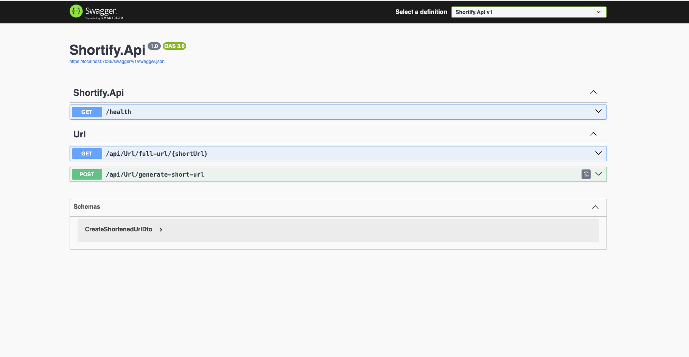

# Shortify API

> A simple URL shortening service backend.



## 🔗 Overview

Shortify API is a .NET 9 Web API that powers URL shortening for the Shortify UI. It exposes endpoints to generate and resolve short links, persists data in PostgreSQL, and includes Swagger documentation and unit tests.

## 🚀 Features

- **CreateShortUrl**: Generate a new short URL for a given long URL
- **GetUrl**: Retrieve the original long URL by its short code
- **Health Check**: Simple `/health` endpoint to verify service status
- **Swagger/OpenAPI**: Interactive API docs available at `/swagger`
- **Unit Tests**: Coverage for business logic and controllers

## 📦 Tech Stack

| Technology            | Purpose                  |
| --------------------- | ------------------------ |
| .NET 9                | Web API framework        |
| C#                    | Core language            |
| PostgreSQL            | Persistent storage       |
| Entity Framework Core | ORM for database access  |
| Swagger (Swashbuckle) | API documentation        |
| xUnit + Moq           | Unit testing and mocking |

## 🛠️ Prerequisites

- **.NET 9 SDK**
- **PostgreSQL** (local or remote)
- **dotnet-ef** tools (`dotnet tool install --global dotnet-ef`)

## 🔧 Installation & Setup

1. **Clone the repo**
   ```bash
   git clone https://github.com/<your-org>/shortify-api.git
   cd shortify-api
   ```
2. **Configure environment**
   Create an `appsettings.Development.json` (or use secrets) with:
   ```json
   {
     "ConnectionStrings": {
       "DefaultConnection": "Host=localhost;Port=5432;Username=postgres;Password=YourPassword;Database=shortify_db"
     }
   }
   ```
3. **Apply database migrations**
   ```bash
   dotnet ef database update
   ```
4. **Run the API**
   ```bash
   dotnet run --project src/Shortify.Api
   ```
   By default, the service listens on `https://localhost:7036`.

## 📄 API Endpoints

| Method | Route                          | Description                               |
| ------ | ------------------------------ | ----------------------------------------- |
| GET    | `/api/url/full-url/{shortUrl}` | Resolve a short code to its original URL  |
| POST   | `/api/url/generate-short-url`  | Generate a new short code from a long URL |
| GET    | `/health`                      | Service health check                      |

### Example: CreateShortUrl

**Request**

```http
POST /api/url/generate-short-url
Content-Type: application/json

{
  "fullUrl": "https://example.com/very/long/path"
}
```

**Response**

```json
{
  "shortUrl": "abc123",
  "fullUrl": "https://example.com/very/long/path"
}
```

## 🧪 Running Tests

Unit tests live in the `tests/Shortify.Api.Tests` project.

```bash
dotnet test
```

## 📄 Swagger Documentation

Once running, navigate to:

```
https://localhost:7036/swagger
```

to explore and try out the API.

## 📄 License

This project is licensed under the MIT License. See [LICENSE](./LICENSE) for details.
